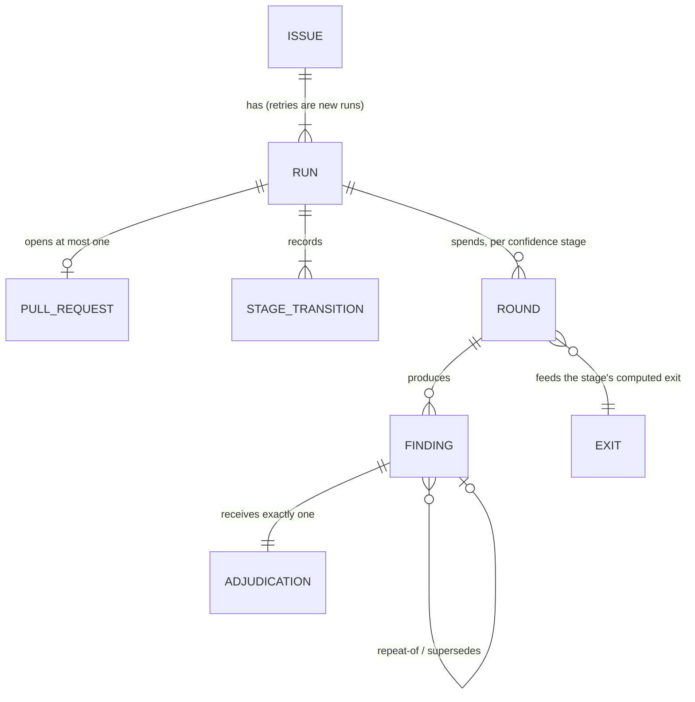
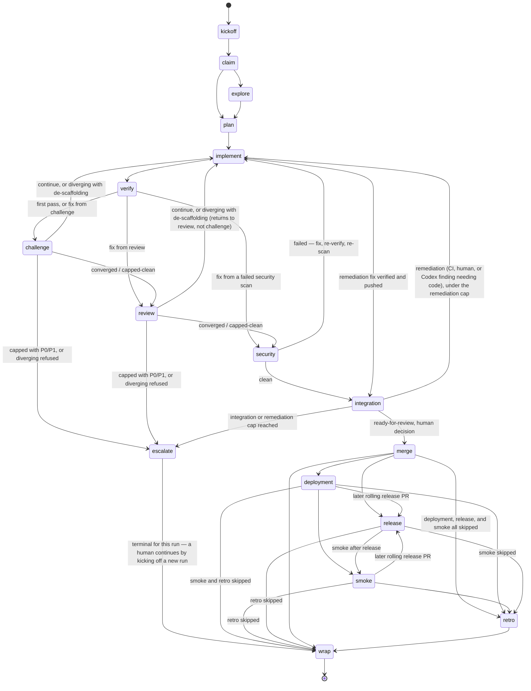

# Domain model

The conceptual model of Harmon DevKit — the core concepts, how they relate,
their lifecycles, and the business rules that govern them. This is the shared
**ubiquitous language**: name things here the same way they are named in code,
specs, and conversation.

## Concepts

The core entities/nouns and what each means.

| Concept | Definition |
|---|---|
| issue | The unit of work and of the success metric. Has one or more runs. |
| run | One execution of the dev flow for an issue, from kickoff until ready-for-review or until it ends earlier (capped, abandoned, escalated); identified by `run_id`; owns a run record, stage transitions, and interventions. |
| stage | A named phase of the lifecycle below. A confidence stage owns rounds. |
| pass | One finder's `result.challenger` or `result.reviewer` at one reviewed head in its confidence stage. |
| round | The aggregate of exactly one pass per configured primary-finder slot at one reviewed head, each filled by its primary or exactly one substitute; the unit caps and `min_rounds` count. Produces findings. |
| finding | One challenger or reviewer observation, immutable, uniquely identified within the run. |
| adjudication | The orchestrator's verdict on one finding: adjudicated priority and disposition. Exactly one per finding. |
| exit | The computed outcome of a confidence stage at a point in time, from its adjudicated rounds. |
| pull request | The durable home of a run's evidence once opened; at most one per run. |

## Relationships

How the concepts relate — ownership, cardinality, dependencies.

## Lifecycles

The states a key entity moves through, and what triggers each transition.

### Dev flow — the lifecycle of one change

The stages a change moves through from an issue to a merged, released change.
Optional stages are marked; the rest run on every change. Stage names are the
canonical vocabulary — skills, config keys, and round records use the stage
name, never a synonym (`gauntlet` is retired; see the glossary). **Agents are
named for roles, not stages** (`implementer`, `challenger`, `reviewer`,
`integrator`): challenger serves challenge, and reviewer serves review.

| # | Stage | What happens | Optional |
|---|---|---|---|
| 1 | kickoff | Open the session on an issue; resolve rigor, tier, strategy from config and labels. | |
| 2 | claim | Mark the issue as being worked (assignee, `claim:*` label, claim comment). | |
| 3 | explore | Research / scout the codebase or external sources before committing to a design. | yes |
| 4 | plan | Design or spec the change; write the plan the implementer will be briefed with. | |
| 5 | implement | The implementer produces the change on a branch and returns a result. | |
| 6 | verify | The deterministic target resolved from `.devflow.toml`: shipped defaults are `[gates].round_code = "verify"`, or `[gates].round_docs = "check"` on a docs-only diff. A **check**. | |
| 7 | challenge | The challenger runs adversarial second-model rounds on design and approach, to convergence. Raises confidence; never authoritative. | |
| 8 | review | The reviewer runs verification-lens second-model rounds on correctness, consistency, tests. Raises confidence; never authoritative. | |
| 9 | security | `task security` — secret scan, SAST, dependency audit. A check. | |
| 10 | integration | Open the draft PR, carry it through CI, requested reviews, and the readiness gate to ready-for-review. | |
| 11 | merge | A human merges. Always. | |
| 12 | deployment | Deploy the merged change, normally a GitHub Action. | yes |
| 13 | release | Cut a release, normally via the rolling release PR. | yes |
| 14 | smoke | Post-deploy smoke test, normally a GitHub Action. | yes |
| 15 | retro | Read the run record and round trajectory; file improvement issues. | yes |
| 16 | wrap | Release the claim, close out the session. | |

Stages 5–10 are what the orchestrator drives without a human (the
"unattended" span the dev-flow success metric measures); a human owns 11 and
whatever is optional.

## Business rules & invariants

The rules that must always hold — constraints, validations, policies. These are
what specs and their acceptance criteria enforce (see
[../../specs/](../../specs/)).

- A fix round returns to the stage that produced the findings; challenge and
  review keep separate round counts and caps.
- A finding is adjudicated exactly once, and its adjudication is the only
  view scripts read.
- An issue succeeds only when the run that reached ready-for-review had zero
  interventions and no earlier run for the issue ended in a human action.
